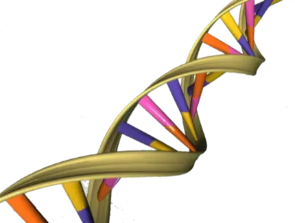
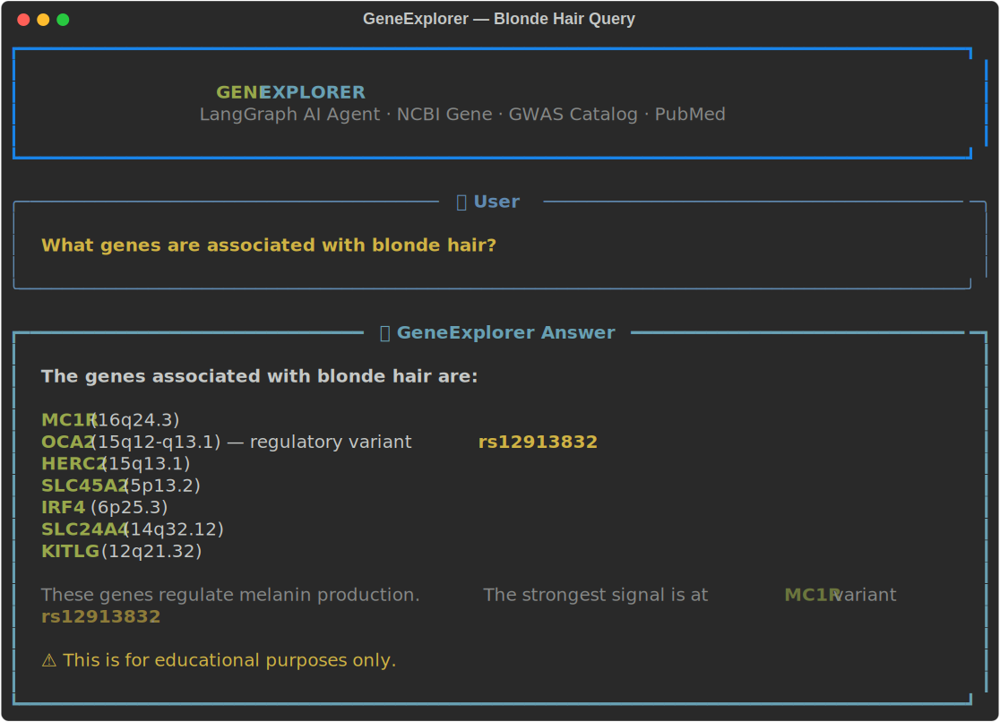
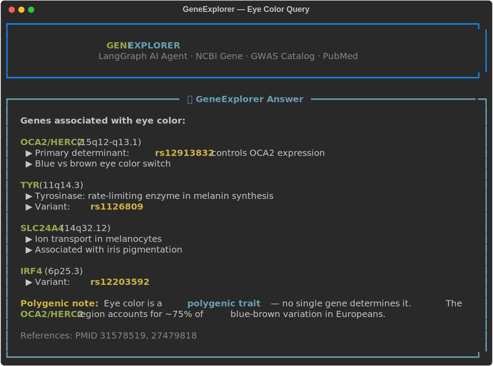
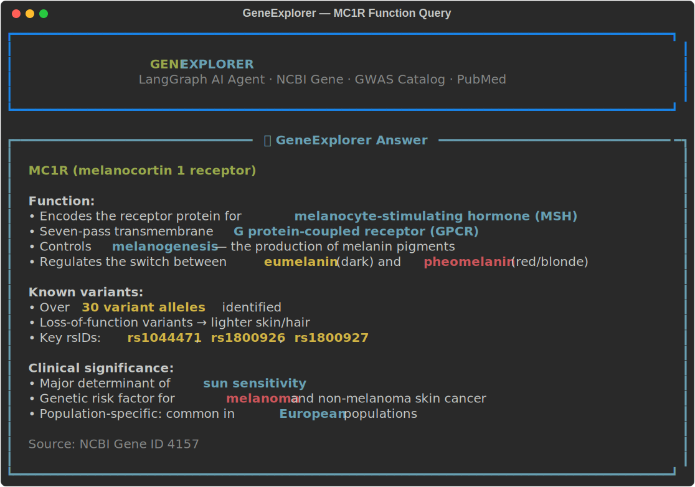

<p align="center">
  
</p>

<p align="center">
  <strong>🤖 Ask any human genetics question. Get answers grounded in public-domain science.</strong>
  <br>
  <em>⚡ NCBI Gene · GWAS Catalog · PubMed · LangGraph ReAct Agent ⚡</em>
</p>

<p align="center">
  <a href="#-features"></a>
  <a href="https://github.com/NullLabTests/geneexplorer/blob/main/LICENSE"></a>
  <a href="https://github.com/NullLabTests/geneexplorer"></a>
  <a href="https://github.com/NullLabTests/geneexplorer/actions"></a>
  <a href="https://github.com/NullLabTests/geneexplorer"></a>
  <a href="https://github.com/NullLabTests/geneexplorer"></a>
</p>

---

## 🚀 Elevator Pitch

**GeneExplorer** is an AI agent that answers human genetics questions by *live-fetching* from public-domain databases — **no hallucination, no guesswork**. Ask *"What genes give me blonde hair?"* and it queries NCBI Gene, the GWAS Catalog, and PubMed in real time, then synthesizes a structured answer with gene symbols, locations, functions, variants (rsIDs), and citations. Built on LangGraph's ReAct architecture, it's accurate, cite-able, and fully transparent.

<div align="center">
  
  <br>
  <sub><em>GeneExplorer answering "What genes are associated with blonde hair?" — live output with Ollama</em></sub>
</div>

---

## ✨ Features

| | Feature | Description |
|---|---------|-------------|
| 🧬 | **NCBI Gene Lookup** | Fetch summaries, chromosomal locations, aliases, and function for any HGNC gene symbol or Entrez ID |
| 📊 | **GWAS Catalog Search** | Real-time trait-gene association lookup via the EBI GWAS Catalog REST API, with curated fallback |
| 📄 | **PubMed Literature** | Search PubMed and retrieve abstracts by PMID for deeper evidence |
| 🔄 | **ReAct Agent** | LangGraph-powered loop: LLM decides which tools to call, reads results, synthesizes cite-able answers |
| 🔌 | **Multi-LLM Backend** | Works with Mistral AI, OpenAI, local Ollama, or OpenRouter — just set `LLM_PROVIDER` |
| 💻 | **CLI + Python API** | Single-query, interactive session, or import as a module |

---

## 📚 Data Sources

All data comes from **public-domain open-science databases** — no proprietary APIs, no paywalls:

| Source | What we use |
|--------|-------------|
| [](https://www.ncbi.nlm.nih.gov/gene) | Gene summaries, location, aliases, function |
| [](https://www.ebi.ac.uk/gwas/) | Trait-gene associations with p-values, PMIDs |
| [](https://pubmed.ncbi.nlm.nih.gov/) | Article titles, abstracts, DOIs |

---

## 🧱 Project Structure

```
geneexplorer/
├── 📄 README.md
├── 📄 requirements.txt
├── 📄 .env.example
├── 📁 src/
│   ├── 🐍 __init__.py
│   ├── 🐍 agent.py              # LangGraph agent, CLI entry point
│   ├── 🐍 prompts.py            # System prompt (accuracy, citations, disclaimers)
│   └── 📁 tools/
│       ├── 🐍 __init__.py
│       ├── 🐍 ncbi_tools.py     # NCBI Gene / Entrez API
│       ├── 🐍 gwas_tools.py     # GWAS Catalog REST API + fallback
│       └── 🐍 web_tools.py      # PubMed search & abstract fetch
├── 📁 docs/                     # Logo, screenshots
├── 📁 scripts/
│   ├── 🐍 demo.py               # Verification demo
│   └── 🐍 tui_screenshots.py    # Rich TUI screenshot generator
├── 📁 data/                     # (optional) downloaded public datasets
├── 📁 frontend/
│   └── 🐍 app.py               # Streamlit chat UI
├── 📁 scripts/
│   ├── 🐍 demo.py               # Verification demo
│   └── 🐍 tui_screenshots.py    # Rich TUI screenshot generator
├── 📁 data/                     # (optional) downloaded public datasets
└── 📁 notebooks/                # Exploration
```

---

## ⚡ Quick Start

### 1. Install

```bash
git clone https://github.com/NullLabTests/geneexplorer.git
cd geneexplorer
python3 -m venv .venv && source .venv/bin/activate
pip install -r requirements.txt
```

### 2. Set your LLM backend

```bash
cp .env.example .env
```

| Provider | `.env` config |
|----------|---------------|
| **Mistral AI** (free credits) | `LLM_PROVIDER=mistral` + `MISTRAL_API_KEY=xxx` |
| **OpenAI** | `LLM_PROVIDER=openai` + `OPENAI_API_KEY=sk-...` |
| **Local Ollama** (no key) | `LLM_PROVIDER=ollama` + `ollama pull llama3.2` |

### 3. Ask a question

```bash
# Single query
python -m src.agent "What genes are associated with blonde hair?"

# Verbose (see every tool call)
python -m src.agent "What is the function of MC1R?" --verbose

# Interactive session (with conversation memory)
python -m src.agent
>>> What genes control eye color?
>>> Tell me more about OCA2   # remembers context
```

### As a Python module

```python
from src.agent import run_query

answer = run_query("What genes are associated with blonde hair?")
print(answer)
```

### Streamlit frontend (optional)

```bash
pip install streamlit
streamlit run frontend/app.py
```

---

## 🔧 What's Under the Hood

### Agent Architecture

```
┌──────────────┐     ┌──────────────────┐     ┌─────────────────┐
│   User       │     │  LangGraph       │     │  Tool Layer     │
│   Query      │────▶│  ReAct Agent     │────▶│                 │
│              │     │                  │     │  🧬 NCBI Gene   │
│  "What genes │     │  ┌────────────┐  │     │  📊 GWAS Catalog│
│   give blond │     │  │    LLM     │  │     │  📄 PubMed      │
│   hair?"     │◀────│  │ (Mistral,  │◀─│◀────│                 │
│              │     │  │  OpenAI,   │  │     │                 │
│              │     │  │  Ollama)   │  │     │                 │
└──────────────┘     │  └────────────┘  │     └─────────────────┘
                     └──────────────────┘
                              │
                              ▼
                     ✅ Structured answer
                        + citations
                        + disclaimers
```

### Available Tools

| Tool | Trigger | Returns |
|------|---------|---------|
| `search_ncbi_gene` | User mentions a gene symbol | Symbol, full name, summary, chromosome, genomic coords, aliases |
| `fetch_ncbi_gene_by_id` | User has an Entrez ID | Same data by numeric ID |
| `search_trait_associations` | User asks about a trait (hair color, height, etc.) | Associated genes, locations, p-values, PMIDs |
| `web_search` | User wants literature confirmation | PubMed article titles, PMIDs, DOIs |
| `fetch_pubmed_abstract` | User asks about a specific study | Full abstract, journal, year |

---

## 📸 Screenshots

<div align="center">
  <h3>🧬 "What genes determine eye color?"</h3>
  
  <br><br>
  
  <h3>🧬 "What is the function of the MC1R gene?"</h3>
  
  <br><br>

  <h3>🧬 Bonus: Generate your own</h3>
  
  ```bash
  python scripts/tui_screenshots.py
  ```
  
  <sub>Customize the queries and re-run to capture your own terminal-style screenshots</sub>
</div>

---

## 📋 Verified Demo

The following was captured live using **Ollama + llama3.2:1b**:

```
$ LLM_PROVIDER=ollama python3 scripts/demo.py

======================================================================
GENEEXPLORER -- TOOL & AGENT VERIFICATION
======================================================================

>>> [Tool 1] search_ncbi_gene("MC1R")
NCBI Gene entry for MC1R [ID: 4157]
Full name: melanocortin 1 receptor
Summary: This intronless gene encodes the receptor protein for
melanocyte-stimulating hormone (MSH). The encoded protein, a seven
pass transmembrane G protein coupled receptor, controls melanogenesis.
...

>>> [Tool 2] fetch_ncbi_gene_by_id("4157")
NCBI Gene entry [4157]
Symbol: MC1R
Full name: melanocortin 1 receptor
...

>>> [Tool 3] search_trait_associations("hair color")
Public literature associations for 'Hair color' (curated from large GWAS):
- MC1R (16q24.3): Key regulator of melanogenesis
- OCA2/HERC2 (15q12-q13.1): Regulatory region rs12913832 controls OCA2
- SLC45A2 (5p13.2): Melanocyte differentiation antigen
- IRF4 (6p25.3): Melanin synthesis regulator
- TYR (11q14.3): Tyrosinase; key enzyme in melanin production
- SLC24A4 (14q32.12): Melanocyte ion transporter
- KITLG (12q21.32): Stem cell factor; melanocyte development

>>> [Agent] run_query("What genes are associated with blonde hair?")
FINAL ANSWER:
The genes associated with blonde hair are:
* MC1R (16q24.3)
* OCA2 (15q12-q13.1) – particularly the regulatory variant rs12913832
* HERC2 (15q13.1)
* SLC45A2 (5p13.2)
* IRF4 (6p25.3)
* SLC24A4 (14q32.12)
* KITLG (12q21.32)
```

---

## ⚠️ Disclaimers

> **This is for educational and informational purposes only.** It is NOT medical, diagnostic, or genetic counseling advice. Genetics is complex and influenced by many factors. Consult a qualified healthcare professional or genetic counselor for personal advice.

---

## 📄 License

MIT — see [LICENSE](LICENSE).

---

<p align="center">
  <sub>Built with ❤️ using </sub>
  <a href="https://langchain-ai.github.io/langgraph/"></a>
  <a href="https://www.ncbi.nlm.nih.gov/gene"></a>
  <a href="https://www.ebi.ac.uk/gwas/"></a>
  <a href="https://pubmed.ncbi.nlm.nih.gov/"></a>
  <br>
  <sub>All data sourced from public-domain open science databases.</sub>
</p>
